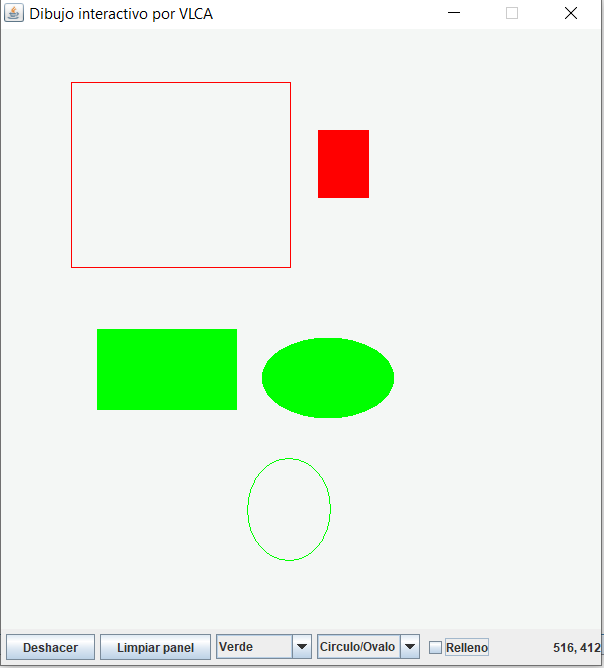

# DibujoInteractivoVLCA

Problematica que se desarrollo:

*Se desarrollo un programa que implemento una aplicación con GUI de dibujo interactivo.  La aplicación dibuja lineas, óvalos y rectángulos, pudiendo seleccionar colores y poder dibujar figuras rellenas.*

# *Link del funcionamiento del programa.*
*https://flipgrid.com/86b87252*

# Elementos visuales y funcionamiento.

*~Existe un botón para deshacer la última figura que se haya dibujado.*

*~Un botón para borrar todas las figuras del dibujo.* 

*~Un botón para seleccionar el color.*

*~Un cuadro combinado para seleccionar la figura a dibujar.*  

*~Una casilla de verificación que especifique si una figura debe estar rellena o sin relleno.*

*~Muestra las coordenadas en las que se encuentra el mouse como funcion adicional.

# -Pre-requisitos 📋

*Se necesita tener las librerias, el github y un IDE.
NetBeans 8.2 y GIT*

# Agradecimientos.

*Levy Rojas(nuestro docente) por alentarnos,y a mi por el esfuerzo.

# Referencias:

*file:///C:/Users/valti/Downloads/Como%20programar%20en%20Java%20-%207ma%20Edicion%20-%20P.%20J.%20Deitel%20(1).pdf*

*https://anabelisa.co/readme/*

# Resultados.

